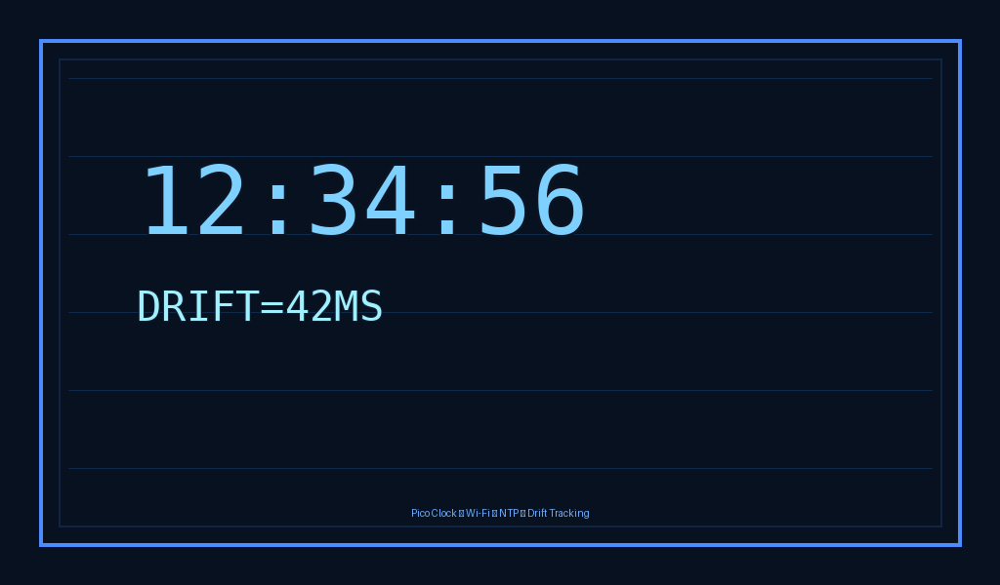

# pico-clock

A Raspberry Pi Pico 2 W firmware project for a compact network clock. The firmware boots, connects to an open Wi-Fi network, validates connectivity with a captive-portal probe, synchronizes time over NTP, tracks drift and latency, and renders the current time and status on a framebuffer-backed display.

## What the firmware does
- Builds with CMake and the Raspberry Pi Pico SDK.
- Targets the Pico W / Pico 2 W family via the Pico SDK's `pico_cyw43_arch` networking stack.
- Connects to open Wi-Fi networks and skips captive-portal probing for password-protected networks. When probing an open network, it tries a small set of common captive-portal endpoints to bypass portal-style redirects.
- Prefers IPv6 NTP resolution with IPv4 fallback and retries against multiple servers.
- Tracks boot-time drift and subsequent time corrections.
- Renders the current time and drift information in a framebuffer display loop.

## Project layout
- `src/main.c` orchestrates boot-time setup and the runtime loop.
- `src/network.c` handles Wi-Fi connection, captive-portal probing, and NTP sync.
- `src/display.c` renders the framebuffer output.
- `src/config.c` manages persistent settings.
- `src/clock.c` tracks time and drift.

## Build
1. Install the ARM toolchain and build tools:
   - `gcc-arm-none-eabi`, `libnewlib-arm-none-eabi`, `build-essential`, and `cmake`.
2. Bootstrap the SDK and local dependencies:
   - `./scripts/bootstrap-pico.sh`
3. Configure a build directory.
   - For a local `pico2_w` build:
     `cmake -S . -B build -DPICO_SDK_PATH=$PWD/.deps/pico-sdk -DPICO_BOARD=pico2_w`
   - To target `pico_w` instead, replace `pico2_w` with `pico_w`.
4. Build the firmware:
   - `cmake --build build -j2`

Build outputs are written under `build/` as `.uf2`, `.elf`, `.bin`, and `.hex` artifacts.

## Notes
- Wi-Fi credentials are configured over the serial console after flashing. Use the `wifi <ssid> [<password>]` command to store credentials persistently; no compile-time Wi-Fi defaults are supported.
- Date display behaviour is also configured over the serial console with the `date on|auto|off` command (or `showdate ...` as an alias). `on` shows the date below the time at all times, `auto` only shows it around midnight, and `off` keeps the existing time-only display.
- The project expects the Pico SDK under `.deps/pico-sdk` and the littlefs sources under `.deps/littlefs`; `./scripts/bootstrap-pico.sh` helps prepare those paths. If configure later complains about missing `lfs.c`, clone littlefs into `.deps/littlefs` before retrying.
