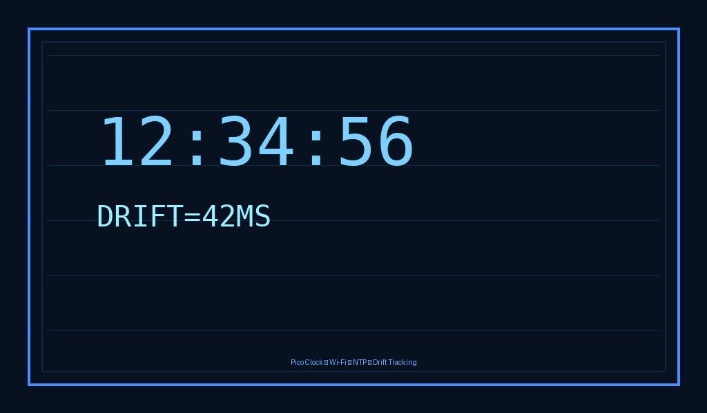

# pico-clock

Documentation site: https://phieri.github.io/pico-clock/

A Raspberry Pi Pico 2 W firmware project for a network clock on the Waveshare PICO-DVI-7inch. The firmware connects to Wi-Fi, validates connectivity with a captive-portal probe on open networks, synchronizes time over NTP, and sends the clock to the display. It also reports the time over USB serial.

## What the firmware does
- Builds with CMake and the Raspberry Pi Pico SDK.
- Targets Pico 2 W via the Pico SDK's `pico_cyw43_arch` networking stack.
- Connects to open Wi-Fi networks and skips captive-portal probing for password-protected networks. When probing an open network, it tries a small set of common captive-portal endpoints to bypass portal-style redirects.
- Tries the configured NTP server addresses (IPv6 then IPv4 by default).
- Tracks synchronization offsets and latency.
- Renders the current time (and optionally the date) in an 800×480 monochrome, packed framebuffer and transmits it as 800×480 DVI video, a mode supported by the Waveshare display (which scales it to its 1024×600 panel).
- Runs video encoding on the second core; the first core handles display updates, serial commands, Wi-Fi and NTP. Network operations may temporarily delay clock updates, but video scanout continues.

## Project layout
- `src/main.c` is the firmware entry point.
- `src/runtime.c` owns the boot-time setup and runtime loop orchestration.
- `src/network.c` handles Wi-Fi connection, captive-portal probing, and NTP sync.
- `src/display.c` renders the framebuffer output.
- `src/display_output.c` drives the Waveshare DVI interface.
- `src/config.c` manages persistent settings.
- `src/clock.c` tracks time and drift.

## Build
1. Install the ARM toolchain and build tools:
   - `gcc-arm-none-eabi`, `libnewlib-arm-none-eabi`, `build-essential`, and `cmake`.
2. Bootstrap the SDK and local dependencies:
   - `./scripts/bootstrap-pico.sh`
3. Configure a build directory.
   - `cmake -S . -B build -DPICO_SDK_PATH=$PWD/.deps/pico-sdk -DPICO_BOARD=pico2_w`
4. Build the firmware:
   - `cmake --build build -j2`

Build outputs are written under `build/` as `.uf2`, `.elf`, `.bin`, and `.hex` artifacts.

## Notes
- Wi-Fi credentials are configured over the serial console after flashing. Use the `wifi <ssid> [<password>]` command to store credentials persistently; no compile-time Wi-Fi defaults are supported.
- The device hostname is also configured over the serial console with the `hostname <name>` command. If no value is provided, it resets to the default `pico-clock` name.
- Date display behaviour is also configured over the serial console with the `date on|auto|off` command (or `showdate ...` as an alias). `on` shows the date below the time at all times, `auto` only shows it around midnight, and `off` keeps the existing time-only display.
- Serial commands are accepted during the first 30 seconds after boot; entering a character extends the window. Wi-Fi and NTP start when the window closes. Connect a USB serial terminal promptly to configure the device.
- Attach the Pico 2 W to the Waveshare PICO-DVI-7inch carrier with its normal 40-pin header and power the screen according to Waveshare's instructions. The carrier routes TMDS clock to GP8/9 and data to GP10/11, GP12/13, and GP14/15. It uses PIO DVI rather than RP2350 HSTX, whose fixed GP12–19 mapping does **not** match this carrier. The display's OSD buttons control brightness; no backlight GPIO is configured.
- The `color` setting controls whether monochrome pixels are on (nonzero) or off. Scanout uses a separate front and back framebuffer so rendering cannot tear a transmitted frame.
- The project expects the Pico SDK under `.deps/pico-sdk`, littlefs under `.deps/littlefs`, and PicoDVI under `.deps/PicoDVI`; `./scripts/bootstrap-pico.sh` prepares these paths. Physical display operation requires testing on the actual hardware.
