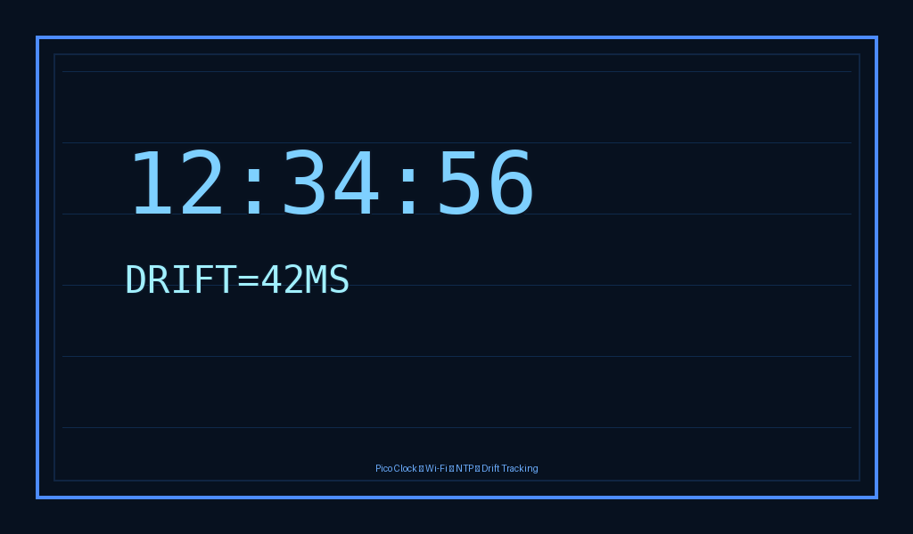

# Pico Clock

A compact Raspberry Pi Pico W / Pico 2 W network clock with a bright display, automatic Wi‑Fi setup, and resilient time sync.

Built for a clean desk, a quiet wall, and a reliable time source that keeps itself online.

## Why it is useful

- Boots quickly and stays online on open Wi‑Fi networks.
- Uses a captive-portal probe and NTP fallback logic to recover from flaky connectivity.
- Tracks drift and latency so the time remains accurate over long sessions.
- Shows the current time and optional date while keeping the display refresh loop lightweight.

## At a glance

  

    <h3>Easy setup</h3>
    
Flash the firmware, connect over serial, and configure the network and hostname in a few commands.

  

  

    <h3>Reliable time sync</h3>
    
Uses IPv6-first NTP resolution with IPv4 fallback and retries against multiple servers.

  

  

    <h3>Battery-friendly</h3>
    
The firmware separates networking work from display rendering so the UI loop can stay focused and responsive.

  

## Quick links

- [Quick start](getting-started.md)
- [Configuration](configuration.md)
- [Troubleshooting](troubleshooting.md)

## Project status

This documentation site is generated automatically by GitHub Actions and published to GitHub Pages.
